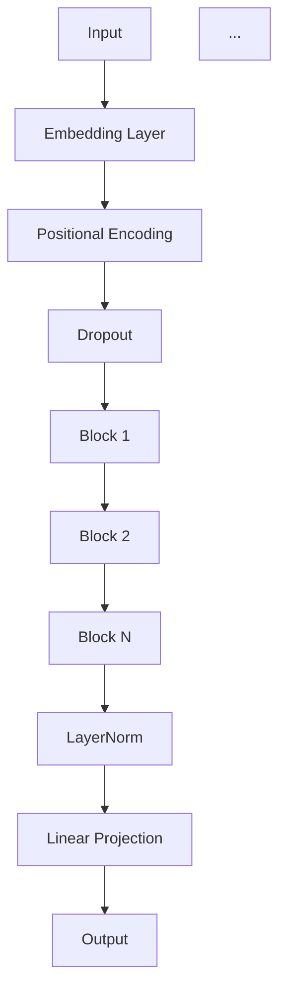

    subgraph Block
        K[LayerNorm] --> L[CausalSelfAttention]
        L --> M[Residual Add]
        M --> N[LayerNorm]
        N --> O[MLP]
        O --> P[Residual Add]
    end

    subgraph CausalSelfAttention
        Q[Linear (Q, K, V)] --> R[Scaled Dot Product Attention]
        R --> S[Linear Projection]
        S --> T[Residual Dropout]
    end

    subgraph MLP
        U[Linear] --> V[GELU]
        V --> W[Linear]
        W --> X[Dropout]
    end
